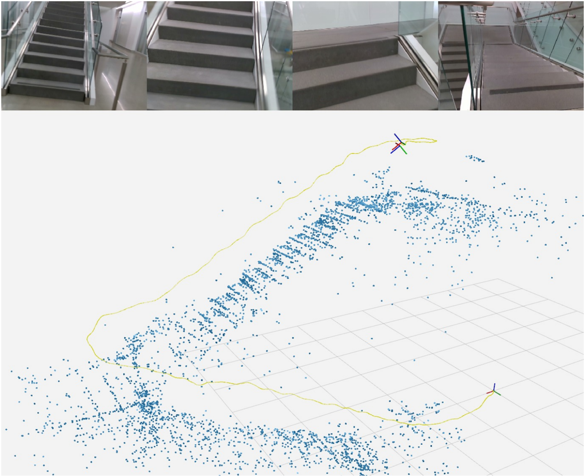
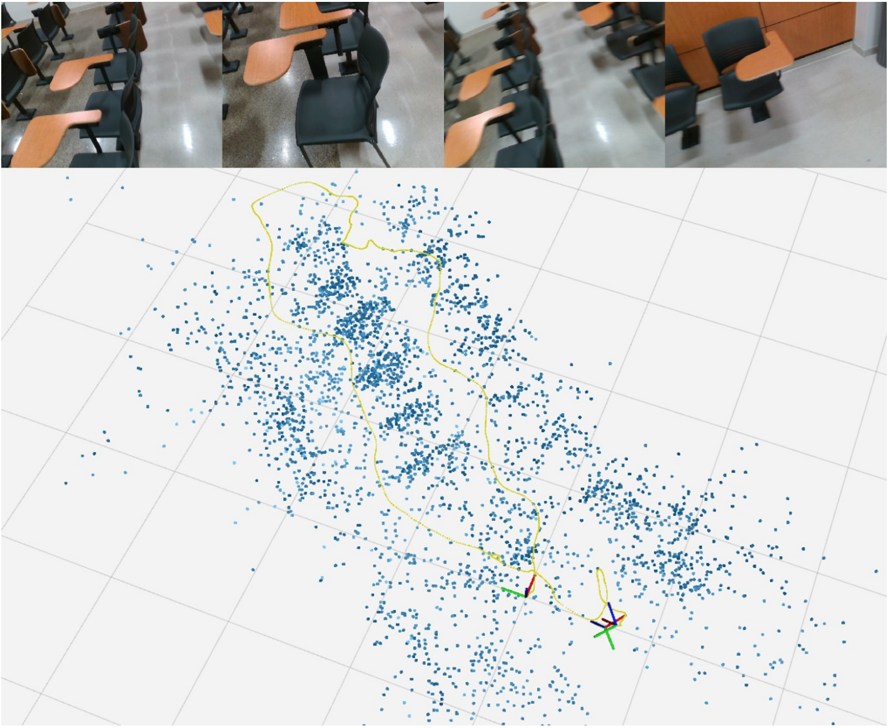
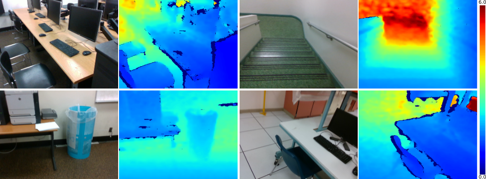

# VOID Dataset
Visual Odometry with Inertial and Depth (VOID) dataset

from *Unsupervised Depth Completion from Visual Inertial Odometry* (in RA-L January 2020 & ICRA 2020)

[[arxiv]](https://arxiv.org/pdf/1905.08616.pdf) [[poster]]()

Authors: [Alex Wong](http://web.cs.ucla.edu/~alexw/), [Xiaohan Fei](https://feixh.github.io/), Stephanie Tsuei

If you use this dataset, please cite our paper:
```
@article{wong2020unsupervised,
 title={Unsupervised Depth Completion From Visual Inertial Odometry},
  author={Wong, Alex and Fei, Xiaohan and Tsuei, Stephanie and Soatto, Stefano},
  journal={IEEE Robotics and Automation Letters},
  volume={5},
  number={2},
  pages={1899--1906},
  year={2020},
  publisher={IEEE}
}
```

To follow the VOID sparse-to-dense-depth completion benchmark, please visit: [Awesome State of Depth Completion](https://github.com/alexklwong/awesome-state-of-depth-completion)

## About the dataset
We propose the VOID dataset for real world use case of depth completion by bootstrapping sparse reconstruction in *metric*}* space from a VIO system ([XIVO][xivo_github]).

The dataset was collected using the Intel [RealSense D435i camera](https://realsense.intel.com/depth-camera), which was configured to produce synchronized accelerometer and gyroscope measurements at 400 Hz, along with synchronized VGA-size (640 x 480) RGB and depth streams at 30 Hz. The depth frames are acquired using active stereo and is aligned to the RGB frame using the sensor factory calibration. All the measurements are timestamped.

The dataset contains 56 sequences in total, both indoor and outdoor with challenging motion. Typical scenes include classrooms, offices, stairwells, laboratories, and gardens. Of the 56 sequences, 48 sequences (approximately 47K frames) are designated for training and 8 sequences for testing, from which we sampled 800 frames to construct the testing set.
Each sequence constains sparse depth maps at three density levels, 1500, 500 and 150 points, corresponding to 0.5%, 0.15% and 0.05% of VGA size.

| Staircase | Classroom |
| :--------: | :-------: |
|  |  |

<p align="center">

</p>

## Dataset structure
For the release version of the dataset:
```
void_release
|---- <density>
      |---- data
            |---- <sequence>
                  |---- image
                        |---- <timestamp>.png
                        |---- ...
                  |---- sparse_depth
                        |---- <timestamp>.png
                        |---- ...
                  |---- validity_map
                        |---- <timestamp>.png
                        |---- ...
                  |---- ground_truth
                        |---- <timestamp>.png
                        |---- ...
                  |---- absolute_pose
                        |---- <timestamp>.txt
                        |---- ...
                  |----K.txt
            |---- ...
      |---- train_image.txt
      |---- train_sparse_depth.txt
      |---- train_validity_map.txt
      |---- train_ground_truth.txt
      |---- train_absolute_pose.txt
      |---- train_intrinsics.txt
      |---- test_image.txt
      |---- test_sparse_depth.txt
      |---- test_validity_map.txt
      |---- test_ground_truth.txt
      |---- test_absolute_pose.txt
      |---- test_intrinsics.txt
|---- ...
```
Densities include 150, 500, and 1500 points, corresponding to the directories void_150, void_500, void_1500, respectively. Text files prefixed with train and test contains the paths for the training and testing sets.

For the raw dataset (rosbags):
```
void_raw
|---- <sequence>
      |---- dataset
      |---- dataset_500
      |---- dataset_1500
      |---- raw.bag
|---- ...
```
Files prefixed with dataset are the output of [XIVO][xivo_github]. The dataset file without the density suffix (``dataset'') denotes the dataset file for 150 points.

## Setting up your virtual environment
We will create a virtual environment with the necessary dependencies
```
virtualenv -p /usr/bin/python3 void-py3env
source void-py3env/bin/activate
pip install numpy opencv-python Pillow matplotlib gdown
```

## Installing ROS (Kinetic)
This is only necessary for processing the raw dataset (rosbag). You may skip this step if you plan on only using the release version.

To install ROS Kinetic:
```
sudo sh -c 'echo "deb http://packages.ros.org/ros/ubuntu $(lsb_release -sc) main" > /etc/apt/sources.list.d/ros-latest.list'
sudo apt-key adv --keyserver 'hkp://keyserver.ubuntu.com:80' --recv-key C1CF6E31E6BADE8868B172B4F42ED6FBAB17C654
sudo apt-get update
sudo apt-get install ros-kinetic-desktop-full
```

To install build packages
```
sudo apt install python-rosinstall python-rosinstall-generator python-wstool build-essential
```

To enable your ROS environment:
```
source /opt/ros/kinetic/setup.bash
```


## Downloading VOID
To download VOID dataset release version using `gdown`:
```
bash bash/setup_dataset_void.sh
```
Note: `gdown` intermittently fails and will complain about permissions

As a workaround you may directly download the dataset by visiting:
```
https://drive.google.com/open?id=1GGov8MaBKCEcJEXxY8qrh8Ldt2mErtWs
https://drive.google.com/open?id=1c3PxnOE0N8tgkvTgPbnUZXS6ekv7pd80
https://drive.google.com/open?id=14PdJggr2PVJ6uArm9IWlhSHO2y3Q658v
```
which will give you three files `void_150.zip`, `void_500.zip`, `void_1500.zip`

Assuming you are in the root of the repository, to construct the same dataset structure as the setup script above:
```
mkdir void_release
unzip -o void_150.zip -d void_release/
unzip -o void_500.zip -d void_release/
unzip -o void_1500.zip -d void_release/
bash bash/setup_dataset_void.sh unpack-only
```

To download the raw VOID dataset (rosbag) using `gdown`:
```
bash bash/setup_dataset_void_raw.sh
```
Note: `gdown` intermittently fails and will complain about permissions

As a workaround you may directly download the dataset by visiting:
```
https://drive.google.com/open?id=19uHUtjUnsZ2zhGPYJ--8xNN1kqpi_uaJ
```
which will give you void_raw.zip

Assuming you are in the root of the repository, to construct the same dataset structure as the setup script above:
```
mkdir void_raw
unzip -o void_raw.zip -d void_raw/
bash bash/setup_dataset_void_raw.sh unpack-only
```

## Loading calibration
Calibration are stored as JSON and text (formatted as JSON) files within the `calibration` folder.

```
void_dataset
|---- <calibration>
      |---- calibration.json
      |---- calibration.txt
```

To read calibration as a map or dictionary:
```
import os, json

calibration_path = os.path.join('calibration', 'calibration.json')

with open(calibration_path, 'r') as json_file:
    calibration = json.load(json_file)
```

Note: we use a radtan (plumb bob) distortion model.

The following are the definitions for the calibration parameter names:
```
f_x, f_y : focal length
c_x, c_y : principal point
k_0, k_1, k_2 : radial distortion coefficients
p_x, p_y : tangential distortion coefficients
b_a, b_g : bias for accelerometer and gyroscope
c_ar, c_as, c_gs, c_gru, c_grl : IMU axis alignment parameters
n_a, n_g : noise for accelerometer and gyroscope
t_camera_to_body : translation vector for camera to imu alignment
w_camera_to_body : rotation (Rodrigues') parameters for camera to IMU alignment
```

## Loading and storing data
To load depth and validity map filepaths:
```
import data_utils

train_sparse_depth_filepath = 'data/void_1500/train_image.txt'
train_validity_map_filepath = 'data/void_1500/train_image.txt'
train_sparse_depth_paths = data_utils.load_paths(train_sparse_depth_filepath)
train_validity_paths = data_utils.load_paths(train_sparse_depth_filepath)
```

To load depth and validity maps:
```
sparse_depth = data_utils.load_depth(train_sparse_depth_paths[0])
validity_map = data_utils.load_validity_map(train_validity_map_paths[0])
```

To store depth and validity maps:
```
sparse_depth_outpath = 'sparse_depth.png'
validity_map_outpath = 'validity_map.png'
data_utils.save_depth(sparse_depth)
data_utils.save_validity_map(validity_map)
```

To read intrinsics or pose (both are store as numpy text files):
```
import numpy as np
K = np.loadtxt('K.txt')
```

## Related projects
You may also find the following projects useful:

- [VOICED][voiced_github]: *Unsupervised Depth Completion from Visual Inertial Odometry*. An unsupervised sparse-to-dense depth completion method developed by the authors, published in the Robotics and Automation Letters (RA-L) 2020 and the International Conference on Robotics and Automation (ICRA) 2020.
- [XIVO][xivo_github]: The Visual-Inertial Odometry system developed at UCLA Vision Lab. The dataset files (e.g. sparse points, absolute poses) in VOID are produced by XIVO.
- [GeoSup][geosup_github]: *Geo-Supervised Visual Depth Prediction*. A single image depth prediction method developed by the authors, published in the Robotics and Automation Letters (RA-L) 2019 and the International Conference on Robotics and Automation (ICRA) 2019. This work was awarded **Best Paper in Robot Vision** at ICRA 2019.


[voiced_github]: https://github.com/alexklwong/unsupervised-depth-completion-visual-inertial-odometry
[xivo_github]: https://github.com/ucla-vision/xivo
[geosup_github]: https://github.com/feixh/GeoSup

## License and disclaimer

This software is property of the UC Regents, and is provided free of charge for research purposes only. It comes with no warranties, expressed or implied, according to these [terms and conditions](license). For commercial use, please contact [UCLA TDG](https://tdg.ucla.edu).
